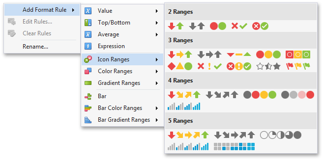
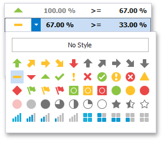
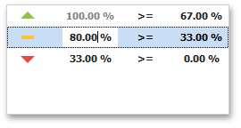
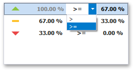

# Icon Ranges
Icon Ranges allow you to use predefined or custom sets of icons to apply conditional formatting to different ranges of values.

To format values according the required condition, click the data item menu button, select **Add Format Rule | Icon Ranges** and choose the required icon set.

This invokes the **Range Set** dialog containing the set of value ranges and corresponding icons. The Grid dashboard item on the right displays the default formatting applied using the predefined set of 3 icons.

This dialog allows you to change the following options specific to Icon Ranges.
* The **Format Style** combo box allows you to change the icon set used to apply formatting.
* The **Use % ranges** check box specifies whether the percent or absolute scale is used to generate ranges.
	
	> [!NOTE]
	> Note that this option is not available for date-time dimensions.
* To change the icon displayed for values corresponding to the specified range, click the button next to the required icon and select a new icon.
	
	
	
	Select **No Style** to disable the indication for the required range.
* You can change range boundaries by specifying the required values.
	
	
	
	> [!NOTE]
	> Note that a new value should fall into a range between corresponding values of the previous and next range.
* To change the comparison logic for the required range, click the comparison sign and select the required option.
	
	
	
	The _greater or equal_ sign includes the smallest value of the current interval while the _greater_ sigh excludes the smallest value from the current interval and includes it in the next interval.
* Use the **Add** and **Delete** buttons to add new ranges or delete the selected range respectively. Note that new range is added below the selected range.