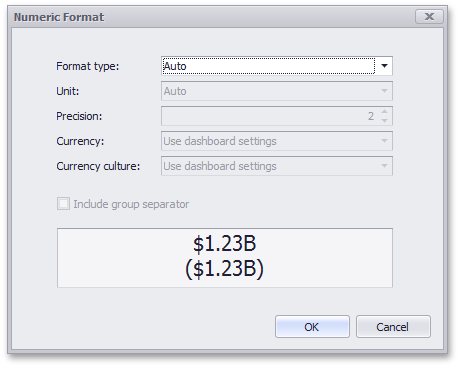
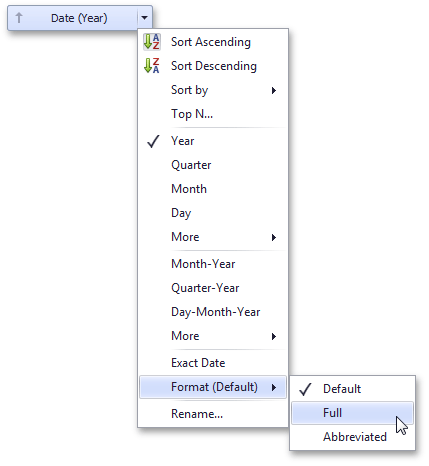
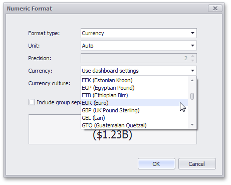
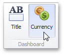
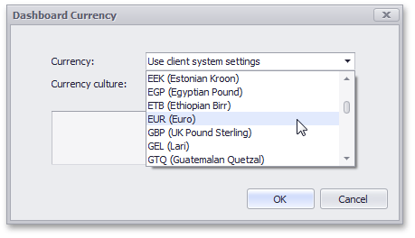

# Formatting Data
Dashboard allows you to customize various data format settings for numeric and date-time values.
* [Formatting Numeric Values](#formatting-numeric-values)
* [Formatting Date-Time Values](#formatting-date-time-values)
* [Currency Formatting Specifics](#currency-formatting-specifics)

## <a name="formatting-numeric-values"/>Formatting Numeric Values
To specify a format for numeric values, select **Format** from the data item menu.

This invokes the **Numeric Format** window.

In the **Format type** field, select the required format type.

| Format Type | Description |
|---|---|
| **Auto** | Format settings are automatically determined based on the data type. |
| **General** | Converts a number to the most compact of either fixed-point or scientific notation, depending on the type of the number. |
| **Number** | Converts a number to a string of the "-d,ddd,ddd.ddd…" form where "-" indicates a negative number symbol (if required), "d" indicates a digit (0-9), "," indicates a group separator, and "." indicates a decimal point symbol. |
| **Currency** | Converts a number to a string that represents a currency amount. To learn about currency formatting specifics, see the [Currency Formatting Specifics](#currency-formatting-specifics) section of this document. |
| **Scientific** | Converts a number to a string of the "-d.ddd…E+ddd" or "-d.ddd…e+ddd" form where each "d" indicates a digit (0-9). |
| **Percent** | Multiplies a number by 100 and converts it to a percentage string. |

Other format settings are in effect for only specific format types.

| Setting | Description | Format Types |
|---|---|---|
| **Unit** | The unit to which values should be converted. | Number, Currency |
| **Precision** | The number of fractional digits that should be displayed. | Scientific, Percent |
| **Currency** | Defines the currency sign and format settings that should be used to display currency values. To learn about currency formatting specifics, see the [Currency Formatting Specifics](#currency-formatting-specifics) section of this document. | Currency |
| **Currency culture** | For currencies used in a region with several cultures, specifies the culture that defines format settings. | Currency |
| **Include group separator** | Specifies whether or not separators should be inserted between digit groups. | Number, Currency, Percent |

## <a name="formatting-date-time-values"/>Formatting Date-Time Values
To specify a format for date-time values, use the **Format** submenu in the data item menu.

This submenu lists the available format types that depend on the selected group interval (for details on group intervals, see [Grouping](grouping.md)).

> [!NOTE]
> Specific group intervals do not have format options. This means that corresponding values can only be presented in a single manner. The **Format** submenu is not displayed for such group intervals.

The following list shows format types by group interval.
* Year
	* _Full_ - The full year pattern (Example - 6&#47;15&#47;2017 1:45:30 PM -&gt; 2017 (en-US)).
	* _Abbreviated_ - The year from 00 to 99 (Example - 6&#47;15&#47;2017 1:45:30 PM -&gt; 17 (en-US)).
* Quarter
	* _Full_ - The full quarter pattern (Example: 6&#47;15&#47;2017 1:45:30 PM -&gt; Q2 (en-US)).
	* _Numeric_ - The quarter from 1 through 4 (Example: 6&#47;15&#47;2017 1:45:30 PM -&gt; 2 (en-US)).
* Month
	* _Full_ - The full name of the month (Example: 6&#47;15&#47;2017 1:45:30 PM -&gt; June (en-US)).
	* _Abbreviated_ - The abbreviated name of the month (Example: 6&#47;15&#47;2017 1:45:30 PM -&gt; Jun (en-US)).
	* _Numeric_ - The month from 1 through 12 (Example: 6&#47;15&#47;2017 1:45:30 PM -&gt; 6 (en-US)).
* Hour
	* _Long_ - Long hour pattern, 12-hour format (Example: 6&#47;15&#47;2017 1:45:30 PM -&gt; 1:00 PM).
	* _Short_ - Short hour pattern, 24-hour format (Example: 6&#47;15&#47;2017 1:45:30 PM -&gt; 13).
* Day of Week
	* _Full_ - The full name of the day of the week (Example: 6&#47;15&#47;2017 1:45:30 PM -&gt; Monday (en-US)).
	* _Abbreviated_ - The abbreviated name of the day of the week (Example: 6&#47;15&#47;2017 1:45:30 PM -&gt; Mon (en-US)).
	* _Numeric_ - The day of the week from 1 through 7 (Example: 6&#47;15&#47;2017 1:45:30 PM -&gt; 2 (en-US)).
* Day-Month-Year
	* _Long_ - Long date pattern (Example: 6&#47;15&#47;2017 1:45:30 PM -&gt; Monday, June 15, 2017 (en-US)).
	* _Short_ - Short date pattern (Example: 6&#47;15&#47;2017 1:45:30 PM -&gt; 6&#47;15&#47;2017 (en-US)).
* Date-Hour
	* _Long_ - Long date pattern, long hour pattern (Example: 6&#47;15&#47;2017 1:45:30 PM -&gt; Monday, June 15, 2017 1:00 PM (en-US)).
	* _Short_ - Short date pattern, long hour pattern (Example: 6&#47;15&#47;2017 1:45:30 PM -&gt; 6&#47;15&#47;2017 1:00 PM (en-US)).
	* _Time only_ - Long hour pattern (Example: 6&#47;15&#47;2017 1:45:30 PM -&gt; 1:00 PM (en-US)).
* Date-Hour-Minute
	* _Long_ - Long date pattern, long time pattern (Example: 6&#47;15&#47;2017 1:45:30 PM -&gt; Monday, June 15, 2017 1:45 PM (en-US)).
	* _Short_ - Short date pattern, long time pattern (Example: 6&#47;15&#47;2017 1:45:30 PM -&gt; 6&#47;15&#47;2017 1:45 PM (en-US)).
	* _Time only_ - Long time pattern (Example: 6&#47;15&#47;2017 1:45:30 PM -&gt; 1:45 PM (en-US)).
* Date-Hour-Minute-Second
	* _Long_ - Long date pattern, long time pattern (Example: 6&#47;15&#47;2017 1:45:30 PM -&gt; Monday, June 15, 2017 1:45:30 PM (en-US)).
	* _Short_ - Short date pattern, long time pattern (Example: 6&#47;15&#47;2017 1:45:30 PM -&gt; 6&#47;15&#47;2017 1:45:30 PM (en-US)).
	* _Time only_ - Long time pattern (Example: 6&#47;15&#47;2017 1:45:30 PM -&gt; 1:45:30 PM (en-US)).

The list below illustrates format types related to the **Exact Date** group interval.
* Year
	* _Full_ - The full year pattern (Example: 6/15/2017 1:45:30 PM -> 2017 (en-US)).
	* _Abbreviated_ - The year from 00 to 99 (Example: 6/15/2017 1:45:30 PM -> 17 (en-US)).
* Quarter
	* _n/a_ - The default year and full quarter pattern (Example: 6/15/2017 1:45:30 PM -> Q2 2017 (en-US)).
* Month
	* _n/a_ - The default year pattern and the full name of the month (Example: 6/15/2017 1:45:30 PM -> June, 2017 (en-US)).
* Day
	* _Long_ - Long date pattern (Example: 6/15/2017 1:45:30 PM -> Monday, June 15, 2017 (en-US)).
	* _Short_ - Short date pattern (Example: 6/15/2017 1:45:30 PM -> 6/15/2017 (en-US)).
* Hour
	* _Long_ - Long date pattern, long time pattern (Example: 6/15/2017 1:45:30 PM -> Monday, June 15, 2017 1:00 PM (en-US)).
	* _Short_ - Short date pattern, long time pattern (Example: 6/15/2017 1:45:30 PM -> 6/15/2017 1:00 PM (en-US)).
	* _Time only_ - Long time pattern (Example: 6/15/2017 1:45:30 PM -> 1:00 PM (en-US)).
* Minute
	* _Long_ - Long date pattern, long time pattern (Example: 6&#47;15&#47;2017 1:45:30 PM -&gt; Monday, June 15, 2017 1:45 PM (en-US)).
	* _Short_ - Short date pattern, long time pattern (Example: 6&#47;15&#47;2017 1:45:30 PM -&gt; 6&#47;15&#47;2017 1:45 PM (en-US)).
	* _Time only_ - Long time pattern (Example: 6&#47;15&#47;2017 1:45:30 PM -&gt; 1:45 PM (en-US)).
* Second
	* _Long_ - Long date pattern, long time pattern (Example: 6&#47;15&#47;2017 1:45:30 PM -&gt; Monday, June 15, 2017 1:45:30 PM (en-US)).
	* _Short_ - Short date pattern, long time pattern (Example: 6&#47;15&#47;2017 1:45:30 PM -&gt; 6&#47;15&#47;2017 1:45:30 PM (en-US)).
	* _Time only_ - Long time pattern (Example: 6&#47;15&#47;2017 1:45:30 PM -&gt; 1:45:30 PM (en-US)).

## <a name="currency-formatting-specifics"/>Currency Formatting Specifics
The Dashboard allows you to specify a currency format at two levels: for the entire dashboard and for individual data items.
1. **Data Item Currency**
	
	To specify which currency to use for a particular data item, select **Format** from the data item menu.
	
	
	
	In the **Numeric Format** dialog, select _Currency_ in the **Format type** field and use the **Currency** combo box to select the required currency.
	
	
	
	> [!NOTE]
	> This option only affects the way values are displayed. The Dashboard **does not** convert monetary amounts from one currency to another.
	
	For regions with several cultures, you can also select the culture that will be used to format currency values.
	
	
	
	You can also apply the default dashboard currency by selecting _Use dashboard settings_ in the **Currency** field.
2. **Dashboard Currency**
	
	You can also specify the default currency for the dashboard. This setting will be applied to dashboard items that have no currency defined.
	
	To set the dashboard currency, click the **Currency** button in the Ribbon.
	
	
	
	This invokes the **Dashboard Currency** window. In this window, select the required currency using the **Currency** combo box.
	
	
	
	> [!NOTE]
	> This option only affects the way values are displayed. The Dashboard **does not** convert monetary amounts from one currency to another.
	
	For regions with several cultures, you can also select the culture that will be used to format currency values.
	
	
	
	Additionally, you can specify the client culture that should be used for the dashboard by selecting the _Use client system settings_ item. In this instance, the current system culture will be used in WinForms applications, and the client culture will be used in Web applications.