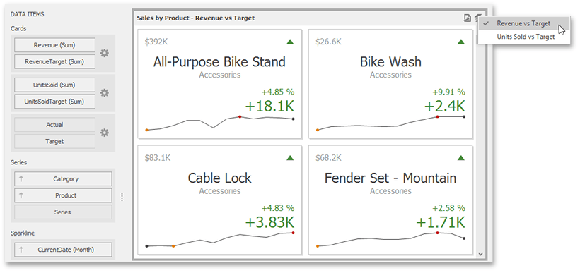

# Providing Data
The Dashboard Designer allows you to bind various dashboard items to data in a virtually uniform manner. To learn more, see the [Binding Dashboard Items to Data](../../binding-dashboard-items-to-data.md) topic.

The only difference is in the data sections that the required dashboard item has. This topic describes how to bind a **Card** dashboard item to data in the Designer.

## <a name="bindingdesigner"/>Binding to Data in the Designer
The image below shows a sample Card dashboard item that is bound to data.

To bind the Card dashboard item to data, drag and drop a data source field to a placeholder contained in one of the available data sections. A table below lists and describes Card data sections.

| Section | Description |
|---|---|
| **Cards** | Contains data items used to calculate values displayed within cards. Data items are arranged in containers. Each _[data item container](../../ui-elements/data-items-pane.md)_ can hold two data items. The first item contains _actual_ data and the second item (optional) contains _target_ data. If both items are provided, cards show the difference between actual and target values. You can fill several data item containers in the Cards section and use the **Values** drop-down menu to switch between the provided values. To invoke the **Values** menu, click the  icon in the dashboard item [caption](../../dashboard-layout/dashboard-item-caption.md) or use its context menu. This drop-down menu is available if the Series section is not empty. Otherwise, a separate card is created for each data item container, and all cards are displayed simultaneously. |
| **Series** | Contains data items whose values are used to label cards. |
| **Sparkline** | Provide a dimension whose data will be used to visualize values using sparklines. |