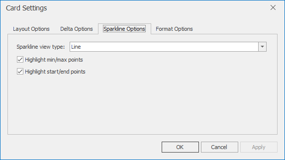

# Sparkline
_Sparklines_ can be used to visualize the variation of [actual or target](providing-data.md) values (for instance, over time).

To learn how to display the sparkline for different layout types, see [Layout](layout.md).
* [Data Binding Specifics](#binding)
* [Change Sparkline Options](#options)

## <a name="binding"/>Data Binding Specifics
You need to provide a date-time or numeric dimension whose data is used as argument values to display a sparkline within the card.

If you have provided both actual and target values, a sparkline visualizes the actual value's variation.

## <a name="options"/>Change Sparkline Options
To manage sparkline settings, click the Options button (the  icon) displayed next to the data item container. In the invoked **Card Settings** dialog, go to the **Sparkline Options** tab:

The following options are available:

| Sparkline Options | Description |
|---|---|
| Sparkline view type | Defines the sparkline’s view type. Sparkline data points can be represented as **area**, **line**, **bars**, or **win** and **loss** squares. |
| Highlight min/max points | Specifies whether to highlight the minimum/maximum points of a sparkline. |
| Highlight start/end points | Specifies whether to highlight the start/end points of a sparkline. |