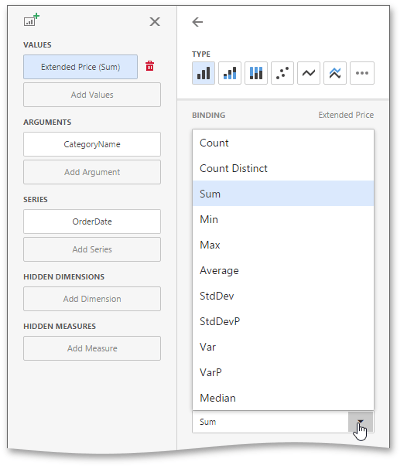

# Summarization
To obtain numeric values that should be displayed within a dashboard item, Dashboard calculates a summary function against the specified measure.

## <a name="summaryfunctiontypes"/>Summary Function Types
The following summary functions are available.
* **Count** - The number of values (excluding **Null** and **DBNull** values).
	
	This is the only summary type that can be calculated against non-numeric data.
* **Count Distinct** - The number of distinct values.
* **Sum** - The sum of the values.
	
	
* **Min** - The smallest value.
* **Max** - The largest value.
* **Average** - The average of the values.
	
	
* **StdDev** - An estimate of the standard deviation of a population, where the sample is a subset of the entire population.
	
	
* **StdDevP** - The standard deviation of a population, where the population is the entire data to be summarized.
	
	
* **Var** - An estimate of the variance of a population, where the sample is a subset of the entire population.
	
	
* **VarP** - The variance of a population, where the population is the entire data to be summarized.
	
	

## Changing Summary Type
By default, Dashboard calculates **Sum** for numeric measures and **Count** for measures that contain another type of data.

You can change the summary function type for numeric measures. To do this, invoke the dashboard item [Bindings](../ui-elements/dashboard-item-menu.md) menu and select the required data item. In the drop-down **Summary Type** list, select the desired summary type.

