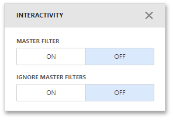

# Dashboard Item Group
The Web Dashboard allows you to combine dashboard items into a group. The dashboard item group serves two main purposes.
* Combine dashboard items within the dashboard into a separate [layout](../dashboard-layout/dashboard-items-layout.md) group.
* Manage [interaction](../interactivity.md) between dashboard items within and outside the group.

For example, you can combine related [filter elements](filter-elements.md) and data visualization [dashboard items](../designing-dashboard-items.md) into a group.

## Create a Group
To create a new group, use the **Group** button (the  icon) in the [Toolbox](../ui-elements/toolbox.md).

You can combine dashboard items into a group using several ways.
* Create a new dashboard item using the buttons inside a group or drag a new item from the [Toolbox](../ui-elements/toolbox.md).
* Move the existing items into a group using drag-and-drop.

> [!NOTE]
> A dashboard item group cannot be added to another group.

## Interactivity
The dashboard item group provides the capability to manage [interaction](../interactivity.md) between dashboard items within and outside the group. To specify interactivity settings, open the Group's [Interactivity](../ui-elements/dashboard-item-menu.md) menu.

The **Master Filter** option allows you to specify whether the current group allows you to filter external dashboard items using master filter items contained within the group. If this option is disabled, master filter items contained within the group can filter only dashboard items from this group.

The **Ignore Master Filters** option allows you to isolate dashboard items contained within the group from being filtered using external master filter items.