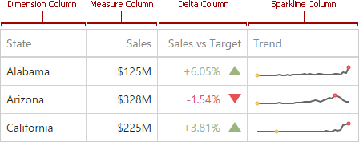
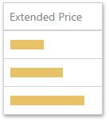
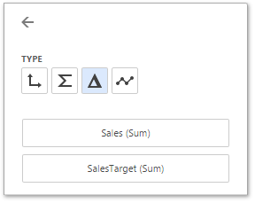
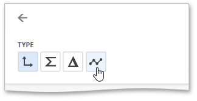

# Columns
The Grid dashboard item supports four types of columns.

* **Dimension**
	
	A dimension column displays values from the bound data item "as is".  If the dimension column is bound to a data source containing images, it can display images.
* **Measure**
	
	A measure column displays summaries calculated against data in the bound data item.
	
	Values in the measure column can be displayed as text or represented by bars.
	
	
	
	To select between these modes, open the column menu and go to the **Options** section.
* **Delta**
	
	A delta column calculates summaries against two measures: the **Actual** value and the **Target** value. When you switch the column type to **Delta**, a new **Target** data item container appears.
	
	
	
	The difference between these values is displayed within the column.
	
	You can configure delta options in the **Delta Options** section of the [column menu](../../ui-elements/data-item-menu.md).
* **Sparkline**
	
	A sparkline column visualizes the variation of summary values over time.
	
	The sparkline column is bound to the measure providing sparkline values and to the dimension providing a date-time interval. Add the required date-time dimension to the **Sparkline** placeholder to show values depending on time.
	
	
	
	You can configure sparkline options in the data item's **Sparkline Options** section.

When you drop a data item into the Columns section, the type for the new column is determined automatically based on the data type.

To change the column type, open the [column menu](../../ui-elements/data-item-menu.md) and click the corresponding type button.

