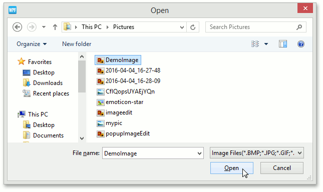
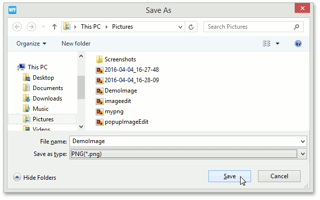
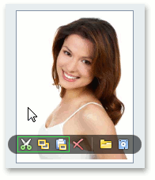

# Image Editor
An image editor allows you to load and display images.

> [!NOTE]
> The following steps may vary depending on application vendor.

## Built-in menu
To access the built-in menu, do one of the following.
* Hover the mouse pointer over the image editor.
* Right-click the image editor.

## Open an image
To load a new image, click the **Open(Load)** button from the built-in menu.

In the invoked dialog, choose an image file and click **Open**.

## Save an image
To save the currently displayed image, open the built-in menu and click the **Save** button.

In the invoked dialog, locate the folder where you want to store your image, enter the file name and click **Save**.

## Using the clipboard

* To cut the currently displayed image and copy it to the clipboard, click the **Cut** button.
* To copy the currently displayed image to the clipboard, click the **Copy** button.
* To retrieve the image from the clipboard, click the **Paste** button.

## Clear the editor
Click the **Clear(Delete)** button to clear editor contents.