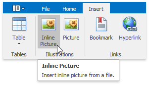
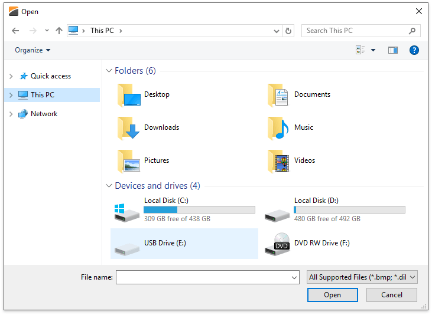
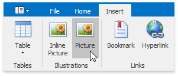
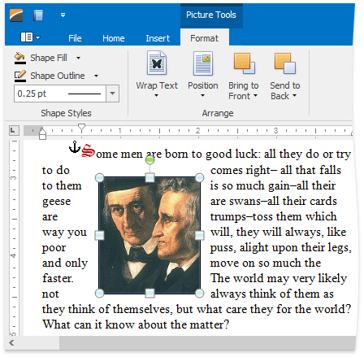

# Insert a Picture
You can insert either [inline](#inlinepicture) or [floating](#floatingpicture) graphics in the document. Currently it is not possible to convert inline to floating and vice versa, so you have to choose beforehand how to anchor your picture.

The **Rich Text Editor** enables you to insert graphics of the following types:
* Bitmap (*.bmp, *.dib)
* JPEG File Interchange Format (*.jpg, *.jpeg)
* Portable Network Graphics (*.png)
* Graphics Interchange Format (*.gif)
* Tagged Image Format (*.tif, *.tiff)
* Microsoft Enhanced Metafile (*.emf)
* Windows  Metafile (*.wmf)

## <a name="inlinepicture"/>Inline Picture
To insert inline picture into your document, position the caret to the desired location and on the **Insert** [ tab](../text-editor-ui/ribbon-interface.md), in the **Illustrations** group, click the **Inline Picture** button.

The **Open** dialog appears, allowing you to locate a file with graphics.

## <a name="floatingpicture"/>Floating Picture
To insert floating picture into your document, position the caret in the paragraph to which the picture should be anchored, and on the **Insert** [ tab](../text-editor-ui/ribbon-interface.md), in the **Illustrations** group, click the **Picture** button.

The **Open** dialog appears, allowing you to locate a file with graphics.

The inserted floating picture is centered horizontally and has an **In Front of Text** wrapping style which you can [change](wrap-text-around-a-picture-or-text-box.md) later.

