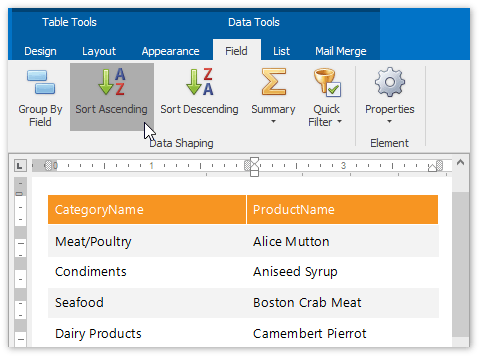
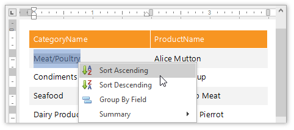
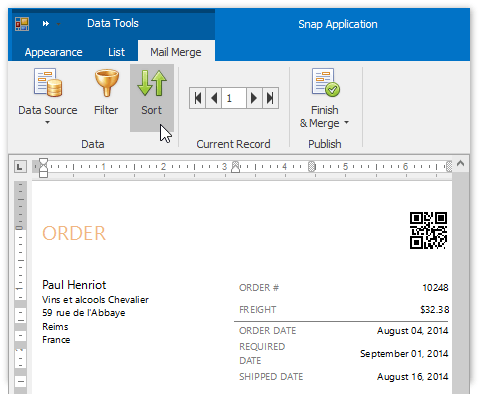
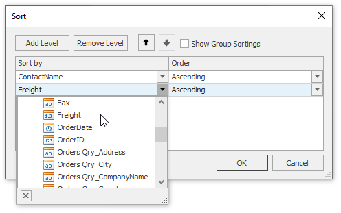
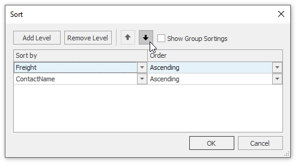
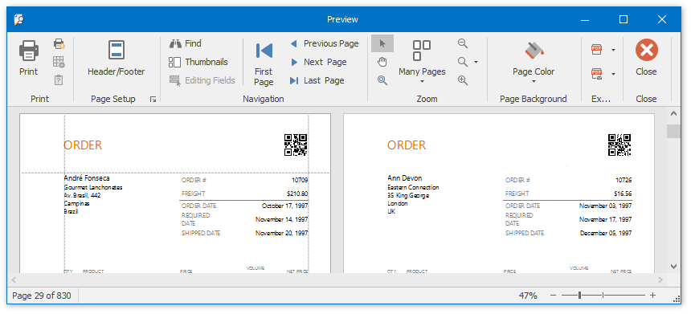

# Sort Data
This document describes how to sort dynamic data within a **Snap** document.

The document consists of the following sections.
* [Sort Snap List Data](#sortsnaplist)
* [Sort Mail Merge Document Data](#sortmailmergedocument)

## <a name="sortsnaplist"/>Sort Snap List Data
To apply sorting to a **Snap list**, do the following.
1. Select the **Snap field** that you wish to use as filter criteria. The field must be located inside a Snap list. This automatically activates the contextual **Field** tab in the main toolbar.
2. In the **Field** tab, click the **Sort Ascending** or **Sort Descending** button, depending on the required sort order. The Snap list will automatically be updated to reflect the sorting applied.
	
	
	
	Sort commands are also available in the context menu.
	
	

You can specify multiple sort criteria for a Snap list. In this case, sort levels are applied in the order that they are added.

## <a name="sortmailmergedocument"/>Sort Mail Merge Document Data
Sorting a **mail merge document** defines the order in which data entries will appear as pages of the final document.

To sort a mail merge document, do the following.
1. Switch to the [Mail Merge](../graphical-user-interface/main-toolbar/data-tools-mail-merge.md) tab of the main toolbar and click the **Sort** command.
	
	
2. Click the **Add Level** button in the invoked **Sort** dialog. Specify the sort criteria and sort order for the additional sort level.
	
	
	
	To change the order in which sort levels are applied to the document, use the arrow buttons.
	
	
	
	Click **OK** to exit the dialog.
3. To view the result, click the **Finish &amp; Merge** button in the **Mail Merge** tab of the main toolbar, and select **Print Preview...** in the invoked  drop-down menu. In the invoked **Export Range** dialog, select **All records** and click **OK**.
	
	
	
	The following image demonstrates a print preview for a sorted mail merge document.
	
	