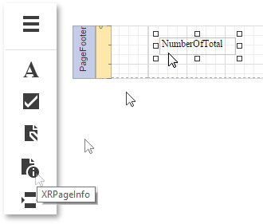
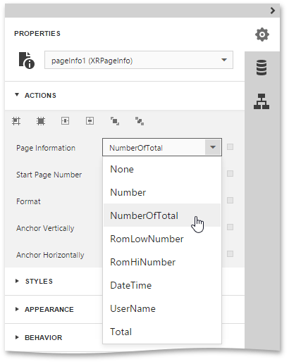
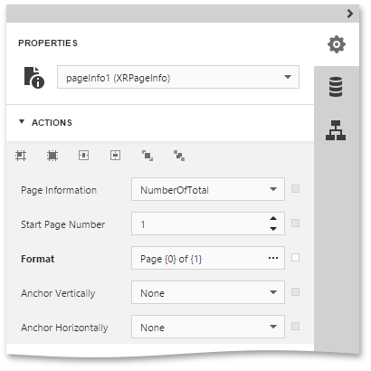
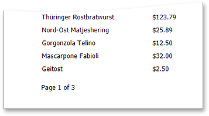
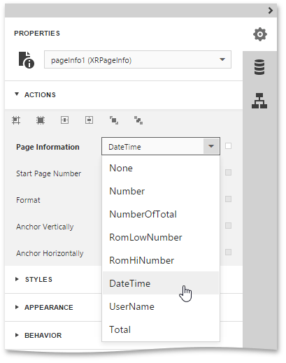
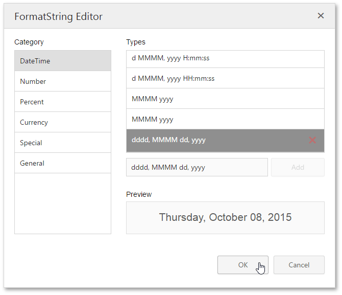
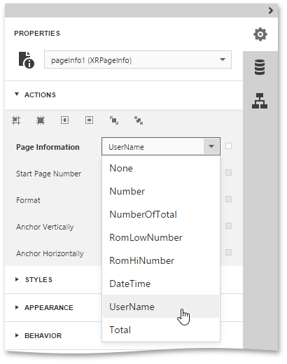
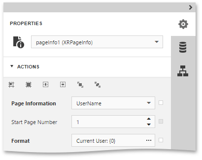
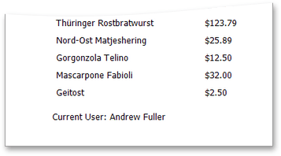

# Add Page Numbers and System Information to a Report
This document describes how to insert _page numbers_ or other system information (e.g., _current date and time_, _user name_, etc.) into a report, using the [Web Report Designer](../../../report-designer.md).

Generally, this auxiliary information is displayed within the Page Header and Footer or Page Margin [bands](../../report-elements/report-bands.md). To add page numbers or system information to your report, drop the [Page Info](../../report-elements/report-controls.md) control from the [Toolbox](../../interface-elements/toolbox.md) onto a band.

Then, follow the instructions below for your specific task.
* [Add Page Numbers](#pagenumbers)
* [Add System Date and Time](#datetime)
* [Add the User Name](#username)

## <a name="pagenumbers"/>Add Page Numbers
1. Select the **Page Info** control, switch to the [Properties Panel](../../interface-elements/properties-panel.md), expand the **Actions** or **Behavior** category and specify the **Page Information** property.
	
	
	
	You can choose one of the following formats for displaying page numbers:
	* **Number** (displays the current page number only);
	* **NumberOfTotal** (displays the current page number with total pages);
	* **RomLowNumber** (the current page number is written in lowercase Roman letters);
	* **RomHiNumber** (the current page number is written in uppercase Roman letters);
	* **Total** (displays the total number of pages).
2. To format the control's text, specify the **Format** property (e.g., **Page {0} of {1}**). You can also specify the _starting page number_.
	
	

Your report with page numbers is now ready. Switch it to the [Preview](../../document-preview.md) mode to view the result.

## <a name="datetime"/>Add System Date and Time
Select the **Page Info** control, and in the [Properties Panel](../../interface-elements/properties-panel.md), expand the **Actions** or **Behavior** category. Then, expand the drop-down list for the **Page Information** property and select **DateTime**.

To format the control's text, click the ellipsis button for the **Format** property, and in the invoked [Format String Editor](../../interface-elements/format-string-editor.md), specify a date and time format string (e.g., **dddd, MMMM dd, yyyy**).

Switch your report to the [Preview](../../document-preview.md) mode to view the result.

## <a name="username"/>Add the User Name
Select the **Page Info** control, and in the [Properties Panel](../../interface-elements/properties-panel.md), expand the **Actions** or **Behavior** category. Expand the drop-down list for the **Page Information** property and select **UserName**.

To format the control's text, specify the **Format** property (e.g., **Current User: {0}**).

Switch your report to the [Preview](../../document-preview.md) mode to view the result.

