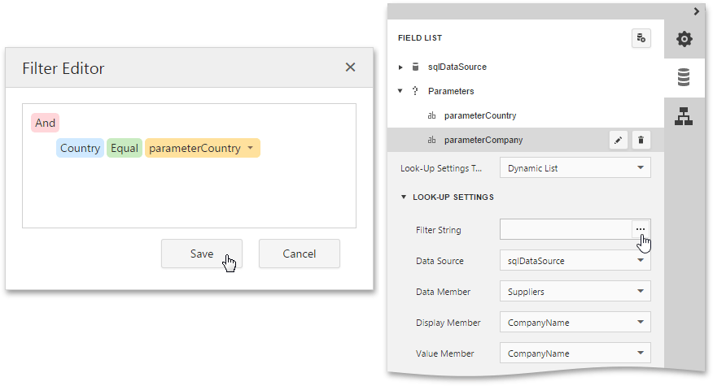
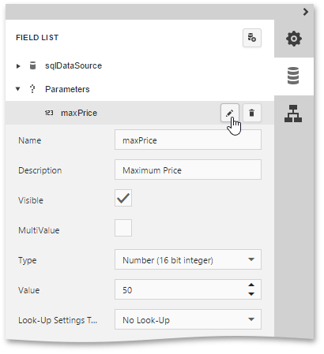
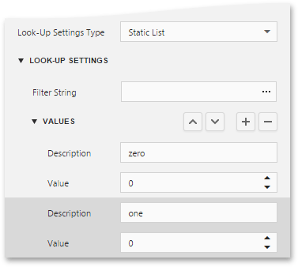
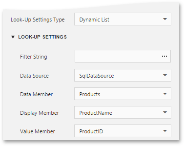
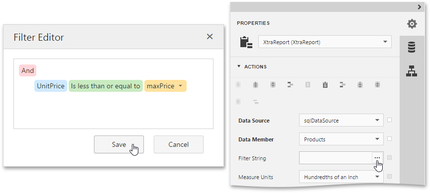
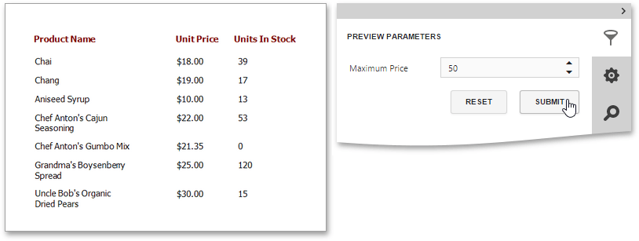

# Report Parameters
This document describes the main concepts of using parameters in the [Web Report Designer](../../../report-designer.md) and provides information on how to create parameters and pass their values.

The document consists of the following sections.
* [Using Parameters](#overview)
* [Create Parameters](#create)
* [Pass Parameter Values](#result)

## <a name="overview"/>Using Parameters
Report parameters provide the capability to pass data of a certain type to a report and are commonly used to achieve the following goals.
* **Filtering**
	
	Probably one of the most common scenarios of using parameters is to filter report data according to the current parameter value by specifying the report's **Filter String**. For more information, see the [Filtering Data](../shaping-data/filtering-data.md) topic.
* **Data Binding**
	
	To show a parameter's value in a report, drag the parameter from the [Field List](../../interface-elements/field-list.md) panel and drop it onto the required band. This creates a **Label** bound to the parameter, as with an ordinary data field.
	
	
	
	For more information, see the [Bind Report Controls to Data](bind-report-controls-to-data.md) topic.
* **Calculated Fields**
	
	Parameters can participate in constructing expressions for [calculated fields](calculated-fields.md), as well as standard data fields. The only difference is that the data field is inserted into the **expression**'s text using its name in **[**square brackets**]**, while a parameter is inserted using the "**Parameters.**" prefix before its name.
* ### Cascading Parameters
	
	You can filter parameter values by specifying the filtering expression that can also include other parameter values. To construct this filtering expression, set the parameter's  **Look-Up Settings Type** property to **Static List** or **Dynamic List** and then specify its **Filter String** property.
	
	
* **Multi-Value Parameters**
	
	If a parameter is bound to a collection of standard values, it is possible to store more than one value in it. To do this, enable the parameter's **MultiValue** property.

## <a name="create"/>Create Parameters
To create a new report parameter, do the following.
1. Switch to the [Field List](../../interface-elements/field-list.md) panel, select the **Parameters** node and click the **Add parameter** button.
	
	
2. Click the **Edit** button (the 'pencil' icon ) to expand the property list and specify the parameter's **Name**, **Description**, **Type** and the parameter's default **Value**.
	
	
	
	Enable the **Visible** property to make the parameter visible in the [Print Preview](../../document-preview.md) and allows modifying its value before report creation.
	
	In this example, keep the **Look-Up Settings** property set to **No Look-Up**. To provide a list of pre-defined values for the parameter, set the **Look-Up Settings** property to a **Static List** or **Dynamic List**.
	* ### Static List
		
		If you choose this item, you can manually fill the list of parameter values with each value having an individual description (specifying how this value appears in the user interface available in a Print Preview).
		
		
	* ### Dynamic List
		
		If you choose this item, you can specify a parameter's data source, data adapter and data member. The value member defines a data field that provides values to the parameter. The display member defines a data field that provides display names for parameter values (how these values appear in the user interface available in a Print Preview).
		
		
		
		The specified data member should conform to the data type specified for the parameter.
3. To define a filtering criteria for the report, switch to the [Properties Panel](../../interface-elements/properties-panel.md), and in the **Actions** or **Data** category, click the ellipsis button for the report's **Filter String** property. In the invoked [Filter Editor](../../interface-elements/filter-editor.md), construct the filtering expression.
	
	To access parameters, expand the drop-down menu for a value placeholder and select the **Parameter** item. This will convert the value placeholder into a parameter placeholder. Click this placeholder to insert the required parameter.
	
	

## <a name="result"/>Pass Parameter Values
To view the resulting report in the [Web Report Designer](../../../report-designer.md), click the **Preview** button  of the [Main Toolbar](../../interface-elements/main-toolbar.md) and specify the values of the required report parameters and data source parameters in the [Preview Parameters Panel](../../document-preview/preview-parameters-panel.md).

