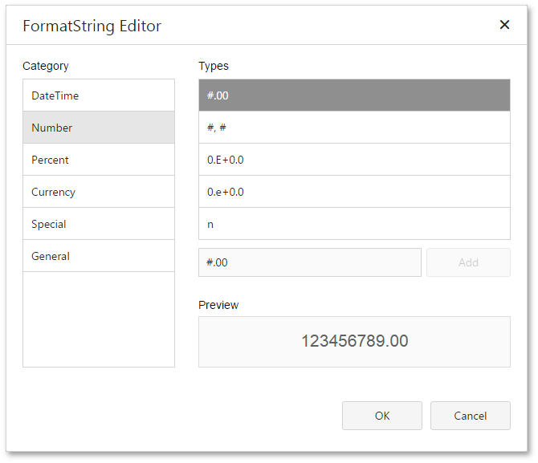
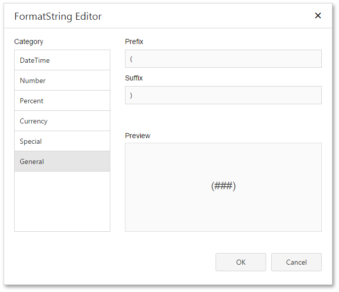
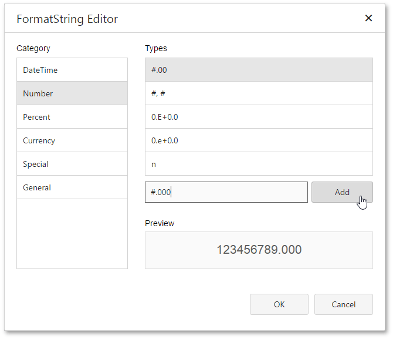
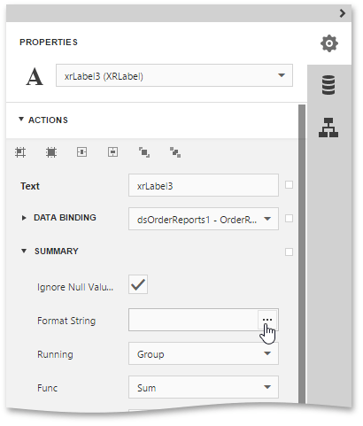

# Format String Editor
The **Format String Editor** provides the capability to apply the required formatting for report elements to display their incoming data. It allows you to easily select one of the built-in formats or create your own. For instance, you can format a numeric value as currency, display a date/time value in one of the standard forms depending on the culture, etc.

This topic consists of the following section.
* [Use Standard Formats](#standardformats)
* [Use General Formats](#generalformats)
* [Create Custom Formats](#customformats)
* [Run the Format String Editor](#run)

## <a name="standardformats"/>Use Standard Formats
The Format String Editor contains numerous built-in formatting presets grouped by categories.

All categories are displayed in the **Category** list on the left side. The **Types** list on the right side contains formats available within the selected category. The editor also allows you to see the preview of the selected format in the **Preview** section.

## <a name="generalformats"/>Use General Formats
In the **General** category, you can enter the **Prefix** and **Suffix** specifying custom text that will be added before and after the output value, respectively.

## <a name="customformats"/>Create Custom Formats
To create a custom format, enter the format string in the dedicated editor and click **Add**. The format will be added to the end of the **Types** list and automatically selected.

You can then remove a custom format by clicking the corresponding  button.

## <a name="run"/>Run the Format String Editor
You can invoke the Format String Editor to format values of a control's bindable properties (not the control's static content) and summary values.
* **Basic Formatting**
	
	It is common to format a label's **Text** property. To do this, expand the **Actions** or **Data** category, and in the **Data Binding** section, click the ellipsis button for the **Format String** property.
	
	
	
	In a similar way, you can also apply formatting to the **Navigation URL** (for example, to add the https:// prefix to the link's contents), **Tag** and **Bookmark** properties.
	
	Note that the set of bindable properties depends on the control type.
* **Formatting Summaries**
	
	When a summary function is applied to a control's dynamic content, value formatting is specified separately. To do this, expand the **Actions** or **Data** category. Then, in the **Summary** section, click the ellipsis button for the **Format String** property.
	
	
	
	The summary format has priority over the general value format.