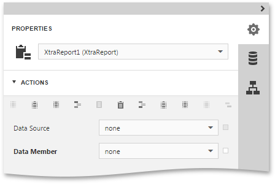
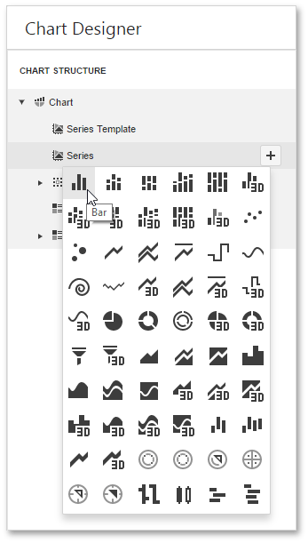
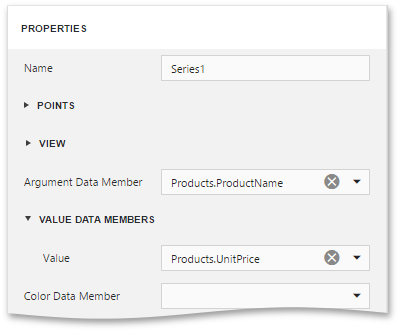
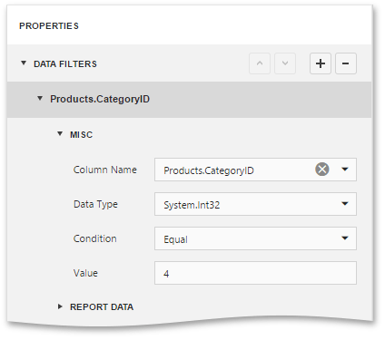
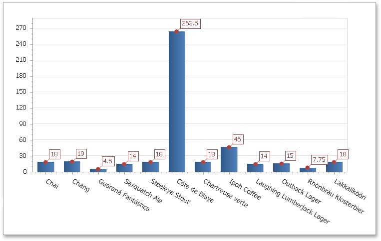

# Chart with Static Series
This document describes how to create a report with a [Chart](../report-elements/report-controls.md) control that displays products and their prices for a selected category. In this example, series data has a single data source, but you can use different data sources for different series if required.

To adjust a Chart by manually creating its series, do the following:
1. [Create a new report](../creating-reports/basic-operations/create-a-new-report.md) and [bind it to a data source](../creating-reports/providing-data/bind-a-report-to-data.md).
2. Drop the [Chart](../report-elements/report-controls.md) control from the [Toolbox](../interface-elements/toolbox.md) onto the report's [Detail band](../report-elements/report-bands.md).
	
	
3. To bind the Chart to a data source, in the [Properties Panel](../interface-elements/properties-panel.md), expand the **Data** category and specify the **Data Source** property.
	
	
	
	> [!NOTE]
	> Set the report's **Data Source** property to **None** after placing the Chart in the Detail band. Otherwise, the Chart repeats at the preview as many times as there are records in the data source.
	> 
	> 
4. Select the Chart control once again and click the **Run Designer** button displayed over it.
	
	
5. In the invoked **Chart Designer**, add a new series to the Chart control. To do this, locate the **Series** element in the **Chart Structure** tree and click the plus button. In the invoked list of series types, select the required type (for example, **Bar**).
	
	
6. To populate the created series with points, select it in the tree and switch **Properties** panel at the right of the Designer's window. Assign the required data fields to the **Argument Data Member** and **Value Data Members** properties to define coordinates for series points.
	
	
7. To filter series data, expand the **Data Filters** category, create and adjust filtering criteria as demonstrated below.
	
	
8. Create one more series with the same settings, but this time, select the **Point** view type.
9. To improve your Chart's appearance, you can make the following adjustments:
	* Remove the Chart's legend as it shows the same data for both series by selecting the **Lagend** item in the **Chart Structure** and setting its **Visibility** property to **False**.
	* The point labels for **Series1** are unnecessary, so set the **Labels Visibility** property to **False**.
	* Rotate the X-axis labels for better readability. To do this, select the **Primary Axis X** node in the tree and adjust properties for its labels (using the **Label** property). For instance, set the **Angle** property to **20** and the **Enable Antialiasing** property to **True**.
	
	It is also possible to customize other Chart properties.

The chart is now ready. Switch your report to the [Preview](../document-preview.md) mode and view the result.

