# Master-Detail Report (Subreports)
This tutorial describes the steps to create a master-detail report using the [Subreport](../report-elements/report-controls.md) control. For an alternative approach, refer to [Master-Detail Report (Detail Report Bands)](master-detail-report-(detail-report-bands).md).

To create a master-detail report using the subreport controls, do the following.
* [Create a Master Report](#create)
* [Create and Customize a Detail Report](#detail)
* [Configure Subreport Parameter Bindings](#subreport)
* [Get the Result](#result)

## <a name="create"/>Create a Master Report
1. [Create a new report](../creating-reports/basic-operations/create-a-new-report.md) and [bind it to a data source](../creating-reports/providing-data/bind-a-report-to-data.md). In the [Report Wizard](../wizards/report-wizard.md), select the data table that will be used as the master table.
	
	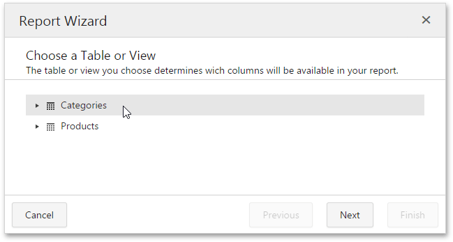
2. Drop the required fields from the [Field List](../interface-elements/field-list.md) onto the [Detail band](../report-elements/report-bands.md). In this tutorial, we'll use the following report layout.
	
	
3. Drag the [Subreport](../report-elements/report-controls.md) control from the [Toolbox](../interface-elements/toolbox.md) and drop it onto the [Detail band](../report-elements/report-bands.md).
	
	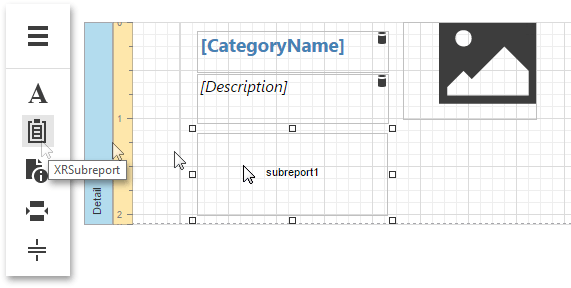
	
	Double-click the added subreport to open the detail report. To switch between master and detail reports, click the corresponding tab in the bottom left corner of the Design Surface.
	
	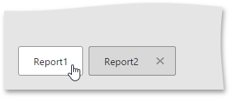

## <a name="detail"/>Create and Customize the Detail Report
1. [Bind](../creating-reports/providing-data/bind-a-report-to-data.md) the detail report to a data source using the [Report Wizard](../wizards/report-wizard.md). In the Report Wizard, select the data table that will be used as the detail table.
	
	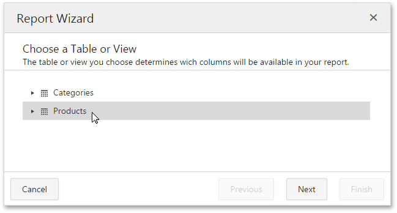
2. Drop the required fields from the [Field List](../interface-elements/field-list.md) onto the [Detail band](../report-elements/report-bands.md). In this tutorial, we'll use the following layout for the detail report.
	
	
3. To add a [parameter](../creating-reports/providing-data/report-parameters.md) to the report, in the [Field List](../interface-elements/field-list.md), select the **Parameters** node and click **Add parameter**.
	
	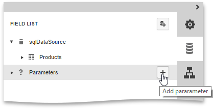
4. Then, specify properties of this parameter as shown below.
	
	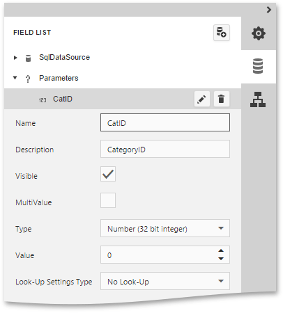
5. To [filter](../creating-reports/shaping-data/filtering-data.md) the detail report data, switch to the [Properties Panel](../interface-elements/properties-panel.md) and click the ellipsis button for the report's **Filter String** property.
	
	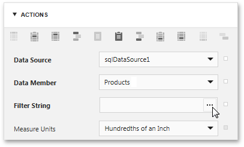
	
	Then, in the invoked [Filter Editor](../interface-elements/filter-editor.md), construct an expression where the **CategoryID** data field is compared to the **CatID** parameter. To add a parameter to an expression, expand the drop-down menu for a value placeholder and select the **Parameter** item. This will convert the value placeholder into a parameter placeholder. Next, click the placeholder to choose the parameter.
	
	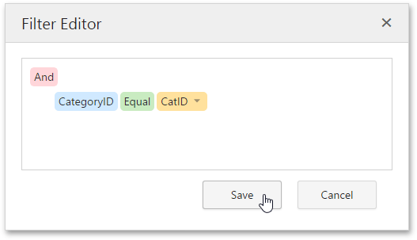
	
	Click **Save** to exit the Filter Editor.
6. Invoke the [menu](../interface-elements/menu.md) of the [Web Report Designer](../../report-designer.md) and click **Save** to save the detail report to the server-side report storage.
	
	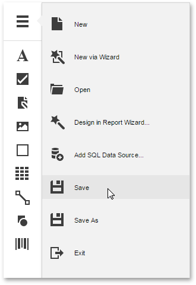
	
	In the invoked **Save Report** dialog, specify the report name and click **Save**.
	
	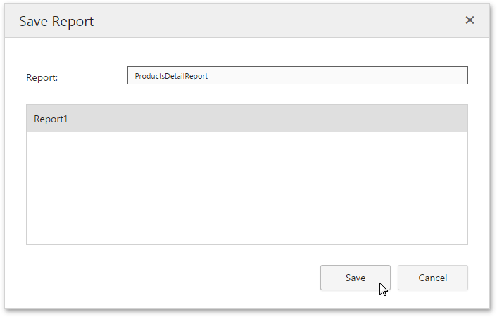
	
	> [!NOTE]
	> You can utilize the Subreport control to re-use an already existing report in the server-side report storage as a detail report. To do this, drop the Subreport control onto a report band, expand the drop-down list for the subreport's Report Source Url property and select the required report.
	> 
	> 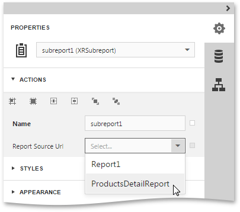

## <a name="subreport"/>Configure Subreport Parameter Bindings
Switch back to the master report and bind the subreport's **CatID** parameter used as a filtering criterion to the master report's **CategoryID** data field, which will serve as a source of the parameter value.

To do this, select the subreport, expand the **Data** category on the [Properties Panel](../interface-elements/properties-panel.md), select the **Parameter Bindings** section and add a new parameter binding. In the binding properties list, specify the data field to which you want to bind a subreport parameter and the name of the parameter that you want to bind.

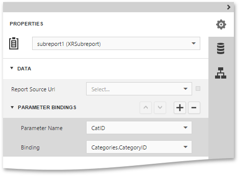

## <a name="result"/>Get the Result
The master-detail report is now ready. Switch the master report to the [Preview](../document-preview.md) mode to view the result.

