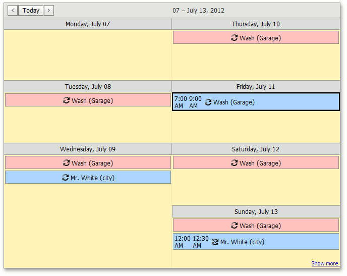
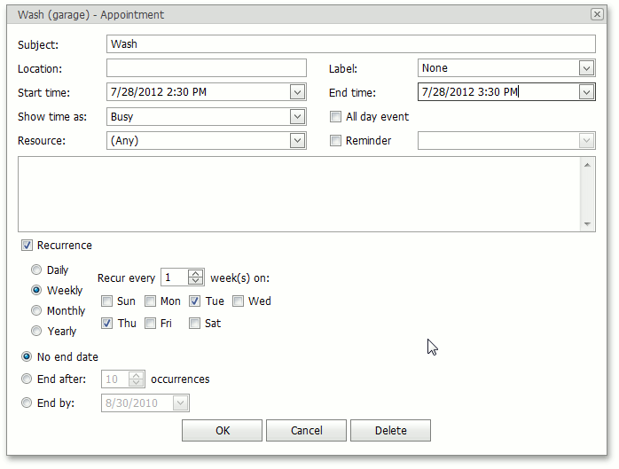
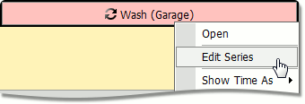
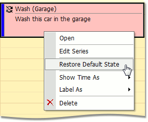

# Make a Series of Recurring Appointments
## What is a Recurring Appointment?
All appointments supported by the **Scheduler** control can be simple (non-recurring) or recurring. Non-recurring appointments occur only once in a specified time interval. Recurring appointments occur many times in the same time interval on different dates.

Recurring appointments are created as series of appointments, specified by the [recurrence pattern](#recurrencepattern) and indicated with the  recurrence sign.

## <a name="recurrencepattern"/>Recurrence Pattern
The recurrence pattern contains information on appointment recurrence (a start date and time of the recurrence series and a rule according to which a series is repeated).

 You can create and edit the recurrence pattern of an appointment in the standard [Edit Appointment](edit-an-appointment.md) dialog, by selecting the **Recurrence** check box. The image below demonstrates the common appearance of the recurrence section of the **Edit Appointment** dialog.

In this dialog you can specify all the required values of different elements to define the recurrence behavior. The base element of the recurrence pattern is frequency. It specifies how often corresponding appointments will occur: **Daily**, **Weekly**, **Monthly** or **Yearly**.

In addition, for each of these frequency types you can define periodicity - the time interval in which the recurrence's frequency will be applied. For instance, if you have defined that appointments occur **Daily**, you can also specify whether appointments repeat every several days or every week day. For the **Monthly** appointment frequency, you can specify for how many weeks and on which week days an appointment will recur.

Also, you can specify when appointment recurrence must be stopped.

If an appointment is recurring, its context menu contains the **Edit Series** item. Clicking this item invokes the **Edit Appointment** dialog that you can use to edit the recurrence pattern.

If you use the **Open** item of the context menu to invoke the **Edit Appointment** dialog, you can edit only the current appointment, rather than the entire series. This way you can create [exceptions](#exceptions).

## <a name="exceptions"/>Exceptions
If an occurrence (appointment that belongs to a series of recurring appointments) has some of its properties modified, it is called an **Exception**. Such appointments are marked with the  crossed recurrence sign.

You can delete one or several  occurrences in the recurrence chain. Deleted occurrence is a kind of Exception for the recurrence pattern. They are not visualized by the SchedulerControl.

To replace an exception with a normal occurrence and discard all modifications, right-click the exception and click on the **Restore Default State** item of the invoked context menu.

If you edit the recurrence pattern for an appointment series (**Edit Series** context menu item), the recurrence chain is reset and all exceptions are restored to a default state. You'll get a warning before this happens.