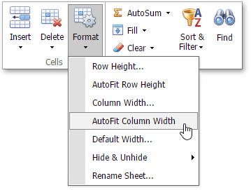
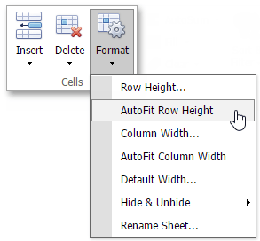

# Specify Column Width and Row Height
## Set the column width
In the **Spreadsheet**, the column width can vary from zero to 255 characters of the default font specified by the predefined _Normal_ style. If you set the column width to zero, the column will be hidden.

To change the column width, do one of the following.
1. Drag the right boundary of the column heading to resize the column width. To set the width of multiple columns, select these columns, and then drag the right boundary of any selected column.
2. To change the column width to automatically fit the contents, select the column and click the **Format** button on the **Home** tab in the **Cells** group. Then, select the **AutoFit Column Width** item from the drop-down list.
	
	

## Set the row height
In the **Spreadsheet**, the row height should be between zero and 409 points. If you set the row height to zero, the row is hidden.

To change the row height, do one of the following.
1. Drag the lower boundary of the row heading until the row is the height you want. To set the height of multiple rows, select them, and then drag the lower boundary of any selected row.
2. To change the row height to automatically fit the contents, select the row and click the **Format** button on the **Home** tab in the **Cells** group. Then, select the **AutoFit Row Height** item from the drop-down list.
	
	